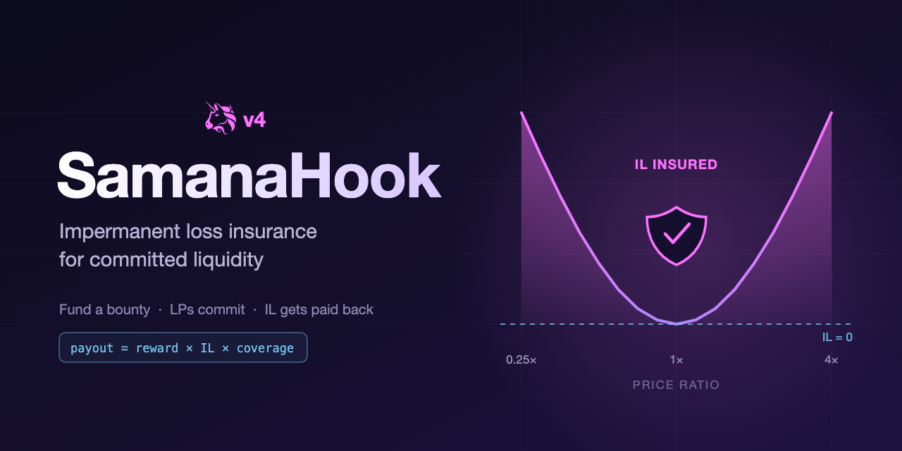

# SamanaHook - IL Insurance for Committed Liquidity

[](https://github.com/diego-G/samana-hook/actions/workflows/test.yml)
[](https://codecov.io/gh/diego-G/samana-hook)

[](https://youtu.be/KIklbhsGRrM)

**[Video](https://youtu.be/KIklbhsGRrM)** · **[Slides](assets/slides/samana-hook-slides.pdf)** · **[Demo](script/demo/instructions.md)** · **[Flow diagrams](docs/flows.md)**

> Anyone who needs committed liquidity during a high-IL window funds a bounty. LPs who stay collect a base reward plus an IL payout proportional to the IL fraction suffered, scaled by `rewardAmount`.

Impermanent loss is worst when a pool needs liquidity most: at launch, during a depeg, after an exploit, around a token unlock. Fee revenue is thin. Volatility is highest. Rational LPs stay out. SamanaHook makes it rational to stay in by insuring against IL during the commitment window.

---

## When to use it

| Scenario | IL driver | Typical creator |
|---|---|---|
| New pool cold-start | Price discovery, zero fees | Protocol launching the token |
| Stablecoin / LST depeg | Peg correlation breaks | Issuer defending the peg |
| Post-exploit re-bootstrap | Pool drained, rebuilding depth | Protocol or DAO treasury |
| Token unlock event | Large supply shock | Whale, foundation |
| Governance vote outcome | Binary price event | DAO |

In every case: someone with a stake in pool depth funds a bounty, LPs commit capital for a fixed window, and collect a flat `rewardAmount` plus an IL payout proportional to the IL fraction suffered.

---

## For bounty creators

A bounty targets a specific Uniswap v4 pool and commits a reward budget to attract and insure LPs during a defined window. All rewards, insurance payouts, and fees are denominated in a single owner-set `bountyToken` (e.g. USDC) - no cross-token accounting, no price-oracle dependency.

### Parameters

| Parameter | What it controls |
|---|---|
| `key` | PoolKey identifying the target Uniswap v4 pool |
| `rewardAmount` | Flat base reward per qualifying LP |
| `minLiquidity` | Minimum net liquidity an LP must hold simultaneously |
| `lockupDuration` | How long an LP must hold before claiming (max one year) |
| `ilCoverageBps` | IL payout multiplier: 0 = flat reward only, 10000 = payout equals `rewardAmount × IL fraction` (max payout = `rewardAmount`) |
| `amount` | Initial `bountyToken` deposit (protocol fee deducted; remainder becomes budget) |

### Creator controls

- `createBounty()` - create a bounty with reward parameters and an initial budget deposit
- `fundBounty()` - top up the budget at any time while the bounty is active
- `deactivateBounty()` - shut down and recover uncommitted budget; already-reserved LP rewards remain claimable

> [!NOTE]
> One bounty slot per pool; a new one can be created after deactivation.

### Budget flow

The budget is the net deposit after protocol fee, a single pot of `bountyToken` that funds both flat rewards and IL insurance payouts. Full-range LPs see two deductions: flat reward at **qualification**, IL insurance payout at **claim**. Concentrated LPs see only the flat reward deduction.

**Phase 1 - Creation:** deposit transferred in; protocol fee deducted upfront; remainder becomes `budget`. Requires `budget >= rewardAmount`.

**Phase 2 - LP qualifies:** when an LP crosses `minLiquidity`, `rewardAmount` is deducted from `budget` and credited to that LP's `lpState.pending`. `lpState.lockupEnd` is set. For full-range positions, `lpState.entryPrice` is snapshotted as the pool's TWAP at that moment; concentrated positions skip the snapshot and receive no IL payout.

**Phase 3 - Lockup:** `budget` unchanged. LP holds position and bears IL.

**Phase 4 - LP claims:** if `ilCoverageBps > 0` and the LP holds a full-range position, the IL insurance payout is computed and added to the base reward; the IL portion is deducted from remaining `budget`, capped at whatever budget is left. A single transfer sends the total (base + payout) to the LP.

**Phase 5 - Deactivation:** remaining `budget` refunded to creator. Already-credited `lpState.pending` balances are not refundable. They belong to qualified LPs and can still be claimed after deactivation.

Example (1000 USDC deposit, no protocol fee, `ilCoverageBps = 10000`, one LP):

| Event | Budget delta | Budget after |
|---|---|---|
| `createBounty` (deposit 1000) | +1000 | 1000 |
| LP qualifies (`rewardAmount` = 100) | −100 | 900 |
| LP claims (IL = 30%, payout = 30) | −30 | 870 |
| `deactivateBounty` | −870 (refund) | 0 |

> [!TIP]
> Budget at least 2× `rewardAmount` per expected qualifying LP: one for the flat reward (committed at qualification) and up to one more for the IL payout (drawn at claim, capped at `rewardAmount` × `ilCoverageBps / 10000` when IL approaches 100%).

→ [Parameter guidance and sizing examples by scenario](docs/use-cases.md)

→ [Bounty creation flow diagram](docs/flows.md#bounty-creation)

---

## For LPs

> [!WARNING]
> IL insurance applies to full-range positions only. Concentrated or range-limited positions receive the base reward but no IL payout.

### LP state fields

Per-LP state is stored in `lpState(poolId, lp)` and contains:

| Field | Type | What it holds |
|---|---|---|
| `liquidity` | `uint128` | Net liquidity (adds minus removes); stops accumulating once qualified |
| `qualified` | `bool` | `true` once the LP has crossed `minLiquidity`; prevents double-qualification |
| `entryPrice` | `uint160` | Pool TWAP (`sqrtPriceX96`) snapshotted at qualification; used to compute IL at claim time |
| `lockupEnd` | `uint256` | Unix timestamp after which the LP may remove liquidity; `0` if no lockup is active |
| `pending` | `uint256` | Claimable reward balance; credited at qualification, zeroed on `claimReward()` |

### How to qualify

1. Add liquidity to the pool, the hook tracks your net liquidity (adds minus removes)
2. When your net liquidity crosses `minLiquidity`, the hook credits your `lpState.pending`, sets your `lockupEnd` timestamp, and snapshots the **TWAP price** (30-min default) as your entry price (manipulation-resistant, not the instantaneous spot)
3. Hold through the `lockupDuration`
4. Call `claimReward()` to receive your base reward plus any IL insurance payout

> [!WARNING]
> **Budget exhaustion.** If remaining budget falls below `rewardAmount` before you qualify, you receive no reward and no lockup. You are free to remove immediately.

→ [Qualification flow diagram](docs/flows.md#how-to-qualify)

### Lockup and claim

Removing liquidity is blocked until your `lpState.lockupEnd` timestamp passes. Once past it, call `claimReward()` to pull:

- **Base reward**: the flat `rewardAmount` credited at qualification
- **IL insurance payout**: computed at claim time if `ilCoverageBps > 0`:

```
base       = rewardAmount (flat reward credited at qualification)
entrySqrt  = TWAP sqrtPriceX96 at qualification time
exitSqrt   = TWAP sqrtPriceX96 at claimReward() call time
r          = (exitSqrt / entrySqrt)²
IL         = 1 − (2√r / (1 + r))
payout     = min(base × IL × (ilCoverageBps / 10000), remaining budget)
```

> [!WARNING]
> The IL payout is proportional to `rewardAmount`, not the LP's position size. An LP with \$100K in the pool and `rewardAmount = 100 USDC` at 1:1 coverage and 30% IL receives a \$30 payout, not \$30K. Size `rewardAmount` accordingly.


> [!IMPORTANT]
> **Claim timing matters.** `claimReward()` can be called any time after `lockupEnd`. The IL payout uses the TWAP at the moment you call, not at the moment the lockup expires. If the exit price diverges further from your entry price after lockup ends, waiting to claim increases your IL payout, but only if the divergence is sustained long enough to shift the TWAP. Factor this into budget sizing: the IL draw can arrive well after the commitment window closes.

→ [Lockup flow diagram](docs/flows.md#lockup) · [Claim flow diagram](docs/flows.md#claim)

---

## Design decisions

**Per-LP, not collective.** Two LPs each adding half the threshold don't combine to qualify. This avoids coordination games at the cost of requiring individual minimums.

**IL insurance draws from remaining budget.** Base reward is committed at qualification. IL insurance payout at claim draws from whatever budget is left.

**Pull-payment pattern.** Rewards are credited to `lpState.pending` at qualification and transferred only when the LP calls `claimReward()`. This avoids reentrancy in hook callbacks and allows claims to succeed even after the bounty is deactivated.

**No external price oracle.** Both the entry price (snapshotted at qualification) and the exit price (read at `claimReward()`) are time-weighted averages of the pool's own tick history (`twapWindow`, default 30 min). No third-party feed means no stale-price risk and no infrastructure dependency. Flash loans cannot sustain a price deviation across multiple blocks, so both measurements are resistant to single-block manipulation.

**Single bounty token for rewards and fees.** All bounties pay out in one owner-set `bountyToken` rather than per-bounty reward tokens. This keeps fee accounting trivially correct (no unit mismatch, no oracle), keeps the treasury holding one known liquid asset, and avoids the failure mode where a pool's own new token crashes exactly when IL is highest.

---

## Running the demo

Three options, in increasing order of realism:

**1. Local lifecycle test** - full lifecycle in a self-contained Foundry test, no setup required.

```bash
forge test --match-test test_lifecycle -vv
```

→ [Demo script and expected output](docs/lifecycle.md)

**2. Sepolia fork test** - same hook deployed against the live Sepolia `PoolManager` on a fork. Skipped automatically when `SEPOLIA_RPC_URL` is not set.

```bash
SEPOLIA_RPC_URL=https://... forge test --match-contract SamanaHookForkTest -vv
```

**3. Live Sepolia walkthrough** - broadcast real transactions against the deployed contracts: bounty creation, LP qualification, lockup reverts, budget exhaustion, and IL insurance payout.

→ [Demo instructions](script/demo/instructions.md)

---

## Known limitations

**Sender caveat.** Hook callbacks receive the router address as `sender`, not the end-user LP. Lockups and rewards are attributed to the router. Production deployments should encode the real LP address in `hookData` and read it in the hook callbacks. The current version is correct for single-user routers and direct integrations.

---

## What's next

- **Pro-rata collective bounties** - two LPs each contributing half the liquidity goal split the reward proportionally
- **ERC1155 position tokens** - lockup metadata travels with the position, enabling secondary markets, delegation, and fractionalization
