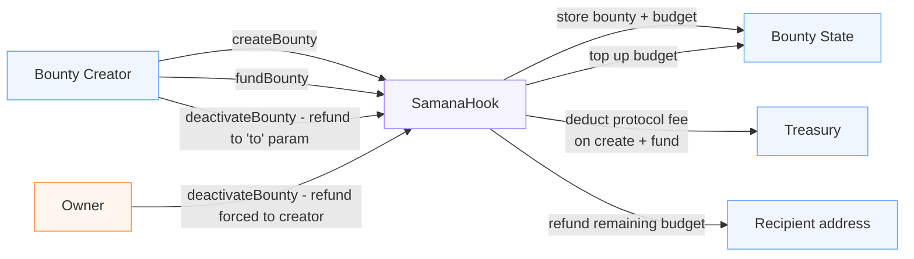
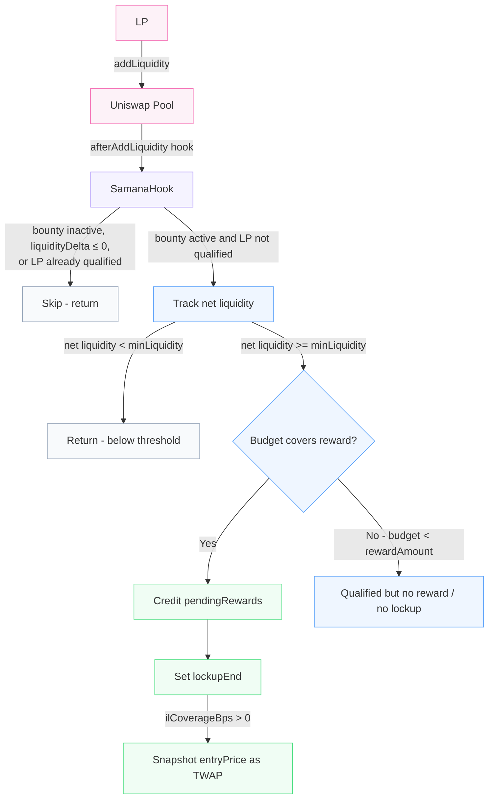
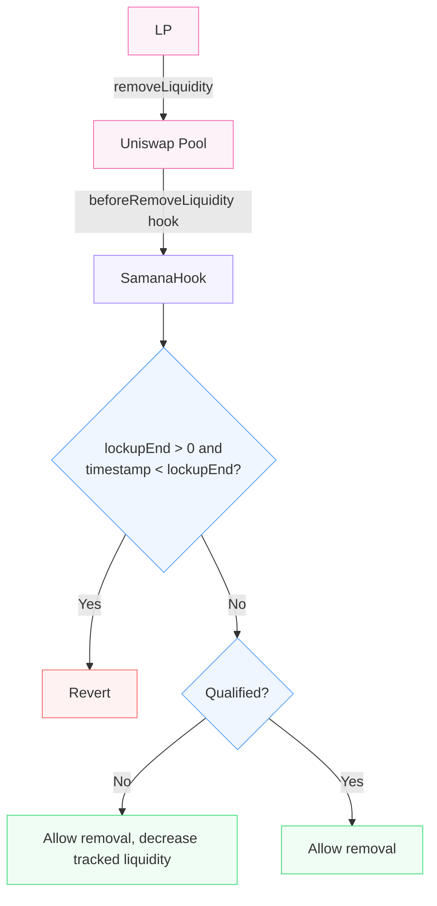
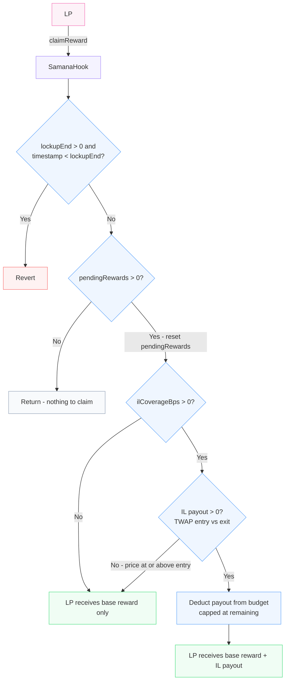

# Hook Flow Diagrams

## Bounty creation

```mermaid
flowchart LR
    classDef purple stroke:#a78bfa,fill:#f5f3ff
    classDef blue stroke:#60a5fa,fill:#eff6ff
    classDef orange stroke:#fb923c,fill:#fff7ed

    A[Bounty Creator] -->|createBounty| B[SamanaHook]
    A -->|fundBounty| B
    A -->|deactivateBounty - refund to 'to' param| B
    OW[Owner] -->|deactivateBounty - refund forced to creator| B
    B -->|store bounty + budget| C[Bounty State]
    B -->|top up budget| C
    B -->|deduct protocol fee\non create + fund| F[Treasury]
    B -->|refund remaining budget| G[Recipient address]

    class A,C,F,G blue
    class B purple
    class OW orange
```

## How to qualify

```mermaid
flowchart TD
    classDef pink stroke:#f472b6,fill:#fdf2f8
    classDef purple stroke:#a78bfa,fill:#f5f3ff
    classDef blue stroke:#60a5fa,fill:#eff6ff
    classDef green stroke:#4ade80,fill:#f0fdf4
    classDef gray stroke:#94a3b8,fill:#f8fafc

    LP[LP] -->|addLiquidity| D[Uniswap Pool]
    D -->|afterAddLiquidity hook| B[SamanaHook]
    B -->|bounty inactive, liquidityDelta ≤ 0,\nor LP already qualified| Z[Skip - return]
    B -->|bounty active and LP not qualified| E[Track net liquidity]
    E -->|net liquidity < minLiquidity| Z2[Return - below threshold]
    E -->|net liquidity >= minLiquidity| G{Budget covers reward?}
    G -->|Yes| H[Credit pendingRewards]
    H --> I[Set lockupEnd]
    I -->|ilCoverageBps > 0| J[Snapshot entryPrice as TWAP]
    G -->|No - budget < rewardAmount| K[Qualified but no reward / no lockup]

    class LP,D pink
    class B purple
    class E,G,K blue
    class H,I,J green
    class Z,Z2 gray
```

## Lockup

```mermaid
flowchart TD
    classDef pink stroke:#f472b6,fill:#fdf2f8
    classDef purple stroke:#a78bfa,fill:#f5f3ff
    classDef blue stroke:#60a5fa,fill:#eff6ff
    classDef red stroke:#f87171,fill:#fef2f2
    classDef green stroke:#4ade80,fill:#f0fdf4

    LP[LP] -->|removeLiquidity| D[Uniswap Pool]
    D -->|beforeRemoveLiquidity hook| L[SamanaHook]
    L --> X{lockupEnd > 0 and\ntimestamp < lockupEnd?}
    X -->|Yes| M[Revert]
    X -->|No| Y{Qualified?}
    Y -->|No| N[Allow removal, decrease tracked liquidity]
    Y -->|Yes| O[Allow removal]

    class LP,D pink
    class L purple
    class X,Y blue
    class M red
    class N,O green
```

## Claim

```mermaid
flowchart TD
    classDef pink stroke:#f472b6,fill:#fdf2f8
    classDef purple stroke:#a78bfa,fill:#f5f3ff
    classDef blue stroke:#60a5fa,fill:#eff6ff
    classDef green stroke:#4ade80,fill:#f0fdf4
    classDef gray stroke:#94a3b8,fill:#f8fafc
    classDef red stroke:#f87171,fill:#fef2f2

    LP[LP] -->|claimReward| P[SamanaHook]
    P --> PL{lockupEnd > 0 and\ntimestamp < lockupEnd?}
    PL -->|Yes| PLR[Revert]
    PL -->|No| PA{pendingRewards > 0?}
    PA -->|No| PB[Return - nothing to claim]
    PA -->|Yes - reset pendingRewards| QB{ilCoverageBps > 0?}
    QB -->|No| T[LP receives base reward only]
    QB -->|Yes| S0{IL payout > 0?\nTWAP entry vs exit}
    S0 -->|No - price at or above entry| T
    S0 -->|Yes| T1[Deduct payout from budget\ncapped at remaining]
    T1 --> TIL[LP receives base reward + IL payout]

    class LP pink
    class P purple
    class QB,S0,T1,PA,PL blue
    class T,TIL green
    class PB gray
    class PLR red
```
